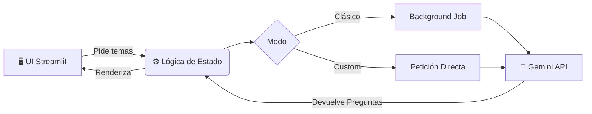

<div align="center">
  <h1>🤑 Atrapa un Millón IA</h1>
  <p><em>Juego interactivo de preguntas y apuestas asistido por Inteligencia Artificial</em></p>
  
  
  
  
  
</div>

---

## 📖 Introducción

**Atrapa un Millón IA** es una aplicación web desarrollada con Streamlit que simula un juego de preguntas por rondas donde los jugadores apuestan dinero virtual en distintas opciones de respuesta. 

La aplicación destaca por su capacidad de generar automáticamente pares de temas o preguntas personalizadas mediante un servicio de IA generativa (`gemini_client.py`), permitiendo alternar entre un modo clásico (generación automatizada en segundo plano) y un modo custom (preguntas a medida del jugador). El flujo completo abarca desde la selección del tema y la fase de apuestas, hasta la resolución de la ronda y la finalización de la partida.

> [!TIP]
> **Vista Rápida**
> La interfaz de usuario principal se encuentra en `app.py`. El sistema utiliza `dotenv` para la gestión segura de claves API y emplea trabajos en segundo plano (background jobs) para optimizar la fluidez del juego en el modo clásico.

---

## 🏗️ Arquitectura del Sistema



## 🚀 Requisitos y Configuración Inicial

- **Python:** 3.10 o superior.
- **Git** *(Opcional, para control de versiones).*
- **API Keys:** Necesarias para el motor de IA generativa.

### 1. Variables de Entorno

Crea un archivo `.env` en la raíz del proyecto para almacenar tus credenciales de forma segura (el sistema las cargará automáticamente):

```env
GEMINI_API_KEY=tu_api_key_aqui
```

### 2. Instalación Local

Clona el repositorio e instala las dependencias utilizando un entorno virtual. Ejecuta los comandos correspondientes a tu sistema operativo:

**Para Windows:**

```powershell
python -m venv venv
.\venv\Scripts\activate
pip install -r requirements.txt
```

**Para macOS / Linux:**

```bash
python3 -m venv venv
source venv/bin/activate
pip install -r requirements.txt
```

### 3. Ejecución

Inicia el servidor local de Streamlit:

```bash
streamlit run app.py
```

> [!NOTE]
> La aplicación se abrirá automáticamente en tu navegador por defecto, generalmente en la dirección `http://localhost:8501`.

---

## 🎮 Guía de Uso Rápida

1. **Seleccionar el Modo de Juego:**
   - **Clásico:** Genera temas de forma automática en segundo plano. Ideal para partidas rápidas.
   - **Custom:** Solicita temas o preguntas específicas personalizadas.

   > [!NOTE]
   > Al cambiar al modo Custom, cualquier generación clásica en segundo plano se cancelará para dar prioridad a tus peticiones a medida.

2. **Preparar la Ronda:** Una vez cargados los temas, el sistema empareja las opciones y prepara la mesa.

3. **Fase de Apuestas:** Distribuye tu saldo virtual entre las diferentes opciones.

   > [!WARNING]
   > Utiliza los controles de la interfaz para ajustar tu saldo. El sistema validará que no excedas tus fondos disponibles antes de confirmar la jugada.

4. **Comodines:** Aplica recursos especiales *(ej. 50%, intercambio, búsqueda en web)* para alterar la dificultad de la ronda.

5. **Resolución:** Al confirmar, se evalúa la respuesta, se actualizan los fondos y se avanza a la siguiente ronda. Al finalizar *(por defecto 8 rondas)*, se muestran las estadísticas finales.

---

## 📂 Estructura del Código

- `app.py` — Entrada principal de la aplicación y renderizado visual (UI).
- `src/` — Núcleo lógico del sistema:
  - `betting.py` — Algoritmos de ajuste y validación matemática de apuestas.
  - `game_logic.py` — Flujo de control, rondas, emparejamientos y resolución.
  - `gemini_client.py` — Conexión y prompts para la generación automática vía IA.
  - `cancel_control.py` — Gestión de hilos (jobs) y cancelaciones de la API.
  - `state.py` — Administración del Session State de Streamlit.
- `assets/` — Recursos estáticos: iconografía, audios e imágenes de la interfaz.
- `docs/` — Archivos fuente de la documentación completa generada con MkDocs.

> [!TIP]
> Si deseas inspeccionar cómo se comunican la interfaz visual y la lógica de negocio, revisa `app.py` y observa las importaciones desde el módulo `src` (por ejemplo, `from src.betting import adjust_bet`).

---

## 🛠️ Solución de Problemas y Testing

- ⏱️ **Problemas de latencia/generación:** Verifica la validez de tu API Key en el archivo `.env` y comprueba que no hayas superado los límites de cuota de tu proveedor. Revisa los logs de la consola.
- 🔄 **Estado inconsistente:** Si la interfaz visual no responde o muestra datos desfasados, fuerza una recarga de la pestaña del navegador o utiliza la función "Hard reset" integrada en la app.

### Ejecutar Pruebas (Tests)

El proyecto incluye una suite de pruebas iniciales para garantizar la integridad de las reglas de apuestas. Para ejecutarlas:

```bash
pytest -q
```

---

## 📚 Documentación Completa (MkDocs)

Este proyecto cuenta con una documentación estática detallada generada a partir del código fuente. Si deseas previsualizarla localmente, ejecuta:

```bash
mkdocs serve
```

Y visita `http://127.0.0.1:8000` en tu navegador para ver la referencia completa de funciones, clases y tutoriales avanzados.