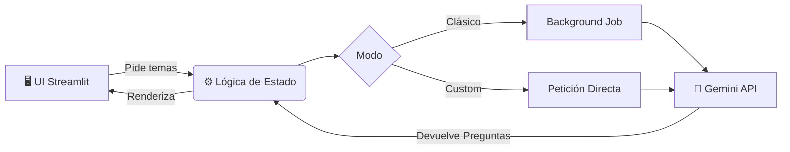

# Atrapa un Millón IA

Una guía práctica para ejecutar y usar la aplicación de Streamlit "Atrapa un Millón IA", una versión interactiva de un juego de preguntas y apuestas asistido por generación automática de preguntas y emparejamientos.

## Introducción

"Atrapa un Millón IA" es una aplicación web hecha con Streamlit que simula un juego de preguntas por rondas donde los jugadores apuestan dinero virtual en opciones de respuesta. La aplicación puede generar automáticamente pares de temas o preguntas personalizadas mediante un servicio de generación (vía `gemini_client.py`) y permite alternar entre un modo clásico (generación en segundo plano) y un modo custom (prioriza generación personalizada). El flujo incluye selección de tema, fase de apuestas, resolución de la ronda y avance hasta completar la partida.


[🕹️ Ver Guía de Uso](#como-usar-la-aplicacion-guia-paso-a-paso){ .md-button .md-button--primary }
[⚙️ Ver Referencia del Código](referencia.md){ .md-button }

---

### ¿Cómo funciona por debajo?




!!! tip "Rápida vista"
    El título de la app es **Atrapa un Millón IA** y la UI está en app.py. La app usa `load_dotenv()` para cargar variables de entorno (API keys, etc.) y tiene un modo clásico que genera contenido en background.

---

## Requisitos previos

- Python 3.10+ recomendado.
- Git (opcional).
- Claves de API necesarias para el servicio de generación (si usas el cliente de generación): coloca las variables en un archivo `.env` en la raíz del proyecto.

Comandos de instalación:

```bash
# Instala dependencias listadas en el repo
pip install -r requirements.txt
```

!!! tip "Variables de entorno"
    Crea un archivo `.env` con las claves que use tu `gemini_client.py` o el proveedor que hayas configurado. Ejemplo:
    ```
    GEMINI_API_KEY=tu_api_key_aqui
    OPENAI_API_KEY=tu_api_key_aqui
    ```

---

## Ejecutar la aplicación localmente

1. **Crea un entorno virtual e instala las dependencias:**

=== "Windows"
    ```powershell
    python -m venv venv
    .\venv\Scripts\activate
    pip install -r requirements.txt
    ```

=== "macOS / Linux"
    ```bash
    python3 -m venv venv
    source venv/bin/activate
    pip install -r requirements.txt

3. Lanza la app con Streamlit:
```bash
streamlit run app.py
```

La aplicación se abrirá en tu navegador, normalmente en `http://localhost:8501`.

!!! info "Servidor de documentación"
    Si modificas la documentación (MkDocs) y quieres previsualizarla:
    ```bash
    mkdocs serve
    ```
    Esto levantará la web de documentación en `http://127.0.0.1:8000`.

---

## Cómo usar la aplicación — Guía paso a paso

A continuación se describe el flujo típico del juego dentro de la UI:

1. Página principal
   - Al abrir la app verás métricas principales: Dinero, Ronda y Modo.
   - En `left` y `right` (diseño en columnas) se muestran controles para generar, seleccionar modo y ver el área de juego.

2. Seleccionar modo
   - `Clásico`: la app genera pares de temas de forma automática en segundo plano (ideal para partidas rápidas).
   - `Custom`: te permite solicitar preguntas o temas personalizados (prioriza contenidos a medida).

   !!! info "Comportamiento al cambiar de modo"
       En modo clásico la generación corre en segundo plano. Si cambias a custom, la generación clásica se cancela y se prioriza la generación de contenido custom.

3. Generar / Cargar temas o preguntas
   - Usa los botones de generación para crear pares clásicos o cargar preguntas custom.
   - En modo clásico la generación puede estar automatizada y ejecutarse en background jobs (ver `cancel_control.py` y funciones asociadas).

4. Preparar la ronda
   - Una vez cargados los temas/preguntas, se emparejan opciones para la ronda actual (`pair_topics_for_current_round` y funciones relacionadas).
   - Se inicializan las apuestas para la pregunta actual con `initialize_bets_for_current_question`.

5. Colocar apuestas
   - En el área de apuestas (`_render_betting_area`) decide cuánto dinero apostar en cada opción.
   - Usa el control `adjust_bet` (backend) para ajustar cantidades; la UI suele validar apuestas con `validate_bets`.

   !!! tip "Gestión de apuestas"
       Antes de confirmar, utiliza los controles de ajuste para distribuir tu saldo. Si la validación falla, revisa que no estés apostando más de tu saldo disponible.

6. Selección de trampas / comodines
   - La app dispone de íconos y recursos en comodines (por ejemplo: 50%, intercambio, búsqueda) que puedes aplicar para modificar la jugada.
   - Cada comodín tiene su lógica de uso en `game_logic.py` o en componentes relacionados.

7. Resolver la ronda
   - Al finalizar la fase de apuestas, resuelve la pregunta (por ejemplo, `resolve_current_round`) para conocer los resultados y actualizar dinero y estado de la partida.
   - La función `advance_round_or_finish` avanza a la siguiente ronda o termina el juego tras la ronda final.

8. Final de partida
   - Al cumplir todas las rondas (por defecto 8 según UI), la app terminará la partida y mostrará resultados acumulados.

---

## Desarrollo y estructura del proyecto

Haz clic en el siguiente bloque para expandir la estructura del código si deseas contribuir o entender la arquitectura:

??? abstract "Estructura de archivos principales"
    * **`app.py`** — Entrada principal de Streamlit y renderizado UI.
    * **`src/`** — Lógica principal:
        * `betting.py` — Lógica de ajuste y validación de apuestas.
        * `game_logic.py` — Flujo de rondas, emparejamientos y resolución.
        * `gemini_client.py` — Lógica de generación automática de preguntas.
        * `cancel_control.py` — Control de jobs de generación.
        * `state.py` — Manejo del estado de sesión de Streamlit.
    * **`assets/`** — Recursos de la interfaz: iconos, audio, imágenes.
    * **`docs/`** — Documentación web de este proyecto.

!!! tip "Explora el código"
    Si quieres entender cómo la UI llama a la lógica, abre `app.py` y busca las importaciones desde `src` (por ejemplo `from src.betting import adjust_bet`).

## Consejos de uso y solución de problemas

- Si la generación tarda o falla:
  - Revisa las variables de entorno y las claves de la API.
  - Consulta logs en la terminal donde ejecutaste `streamlit run app.py`.
- Si cambias de `Clásico` a `Custom` y ves comportamientos extraños, recuerda que el job clásico se cancela al priorizar custom (comportamiento intencional).
- Si la UI se queda en un estado inconsistente, prueba a reiniciar la sesión:
```python
# En la app hay utilidades para reiniciar estado:
# Llamar a la función equivalente en la UI o recargar la página y usar "Hard reset" si existe.
```

!!! tip "Pruebas"
    Hay tests iniciales en test_betting_rules.py. Ejecútalos con:
    ```bash
    pytest -q
    ```
    Esto te ayuda a verificar que la lógica de apuestas sigue funcionando tras cambios.

---

## Extensiones y personalización

- Añade nuevos comodines o modifica sus efectos en `game_logic.py` y comodines.
- Si deseas otro proveedor de generación, adapta `gemini_client.py` o añade un adaptador que respete la interfaz de generación actual.
- Para internacionalizar la UI, centraliza textos en una estructura de configuración y cámbiala desde app.py.

---

## Créditos y recursos

- Proyecto base y documentación generada con MkDocs y el tema Material for MkDocs.
- Interfaz de la app creada con Streamlit.
- Estructura de generación y estado basada en los módulos bajo src.

---

¿Listo para probar? Ejecuta:

```bash
pip install -r requirements.txt
streamlit run app.py
```
